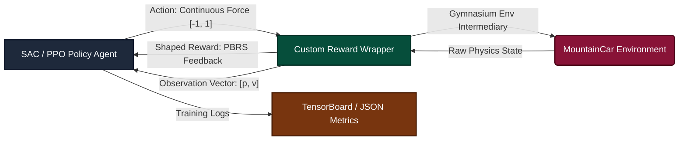

# Continuous Control with Deep Reinforcement Learning (SAC vs PPO)

[](https://opensource.org/licenses/MIT)
[](https://gymnasium.farama.org/)
[](https://stable-baselines3.readthedocs.io/)
[](https://pytorch.org/)
[](https://www.tensorflow.org/tensorboard)

A comparative study in reward engineering and policy optimization applied to continuous control. This repository trains and benchmarks **Soft Actor-Critic (SAC)** and **Proximal Policy Optimization (PPO)** agents on the **MountainCarContinuous-v0** physics environment, demonstrating how **Potential-Based Reward Shaping (PBRS)** overcomes the exploration limits of sparse environment rewards.

---

## 📑 Table of Contents
- [1. Executive Summary](#1-executive-summary)
- [2. System Architecture & RL Loop](#2-system-architecture--rl-loop)
- [3. Environment & Physics Mechanics](#3-environment--physics-mechanics)
- [4. Reward Engineering (PBRS)](#4-reward-engineering-pbrs)
- [5. Codebase Structure](#5-codebase-structure)
- [6. Setup & Execution Instructions](#6-setup--execution-instructions)
- [7. Performance & Comparative Analysis](#7-performance--comparative-analysis)
- [8. Authors & Contributors](#8-authors--contributors)
- [9. License](#9-license)

---

## 1. Executive Summary

This project showcases advanced Reinforcement Learning and reward optimization methodologies:
- **Entropy-Regularized Optimization:** Employs **SAC (Soft Actor-Critic)** to optimize a trade-off between expected returns and action policy entropy, maximizing exploration efficiency.
- **On-Policy vs. Off-Policy Benchmarking:** Evaluates SAC against **PPO (Proximal Policy Optimization)** under identical state-action interfaces.
- **Potential-Based Reward Shaping:** Implements a custom environment wrapper that injects kinetic, height, and proximity potentials to accelerate policy convergence.
- **Robust Experimentation Pipelines:** Runs multiple independent seeds (trials) to calculate mean/standard deviation margins, exporting analytics to TensorBoard and JSON metrics.

---

## 2. System Architecture & RL Loop



---

## 3. Environment & Physics Mechanics

The **MountainCarContinuous-v0** task requires an underpowered car to drive up a steep, sinusoidal hill. Because gravity is stronger than the car's engine, the agent must learn to build momentum by swinging back and forth in the valley.

### 📐 Mathematical Dynamics
- **State Space ($\mathcal{S}$):** Continuous 2D vector $[p_t, v_t]^T$:
  - *Car Position ($p_t$):* $[-1.2, 0.6]$ (Target flag is at $p \ge 0.45$).
  - *Car Velocity ($v_t$):* $[-0.07, 0.07]$.
- **Action Space ($\mathcal{A}$):** Continuous engine force $a_t \in [-1, 1]$.
- **Physics Equations:**
  $$v_{t+1} = v_t + 0.0015 \cdot a_t - 0.0025 \cdot \cos(3 \cdot p_t)$$
  $$p_{t+1} = p_t + v_{t+1}$$
- **Sparse Default Reward:**
  $$R_{default}(s_t, a_t) = \begin{cases} 
      +100 & \text{if } p_t \ge 0.45 \\
      -0.1 \cdot a_t^2 & \text{otherwise}
  \end{cases}$$
  *Baseline models fail to solve this task because they receive no positive feedback until the goal is reached, causing them to stand still to avoid the action penalty.*

---

## 4. Reward Engineering (PBRS)

To resolve the sparse exploration problem, we wrap the environment in a **Potential-Based Reward Shaping (PBRS)** module ([src/custom_env_wrapper.py](file:///C:/Personal/Projects/Data_&_AI/reinforcement-learning-project-main/src/custom_env_wrapper.py)). PBRS guarantees that the optimal policy ($\pi^*$) of the original environment remains unchanged:
$$F(s_t, a_t, s_{t+1}) = \gamma \cdot \Phi(s_{t+1}) - \Phi(s_t)$$

The potential function $\Phi(s)$ is formulated by combining three physical potentials:
1.  **Height Potential ($\Phi_{height}$):** Rewards the agent for climbing higher up either hill:
    $$\Phi_{height}(s) = \sin(3 \cdot p) \cdot 0.45 + 0.55$$
2.  **Kinetic Energy Potential ($\Phi_{kinetic}$):** Rewards the agent for building speed and momentum:
    $$\Phi_{kinetic}(s) = 0.5 \cdot v^2$$
3.  **Goal Proximity Potential ($\Phi_{proximity}$):** Encourages closer proximity to the goal flag:
    $$\Phi_{proximity}(s) = 1.0 - \frac{|p_{goal} - p|}{\text{range}}$$

---

## 5. Codebase Structure

The cleaned, flat repository is organized as follows:
```
reinforcement-learning-project-main/
├── config/
│   ├── config_baseline.yaml      # Default sparse reward hyperparameters
│   ├── config_custom.yaml        # Shaped reward hyperparameters (SAC)
│   └── config_extension.yaml     # Benchmark hyperparameters (PPO)
├── docs/
│   └── Deep_RL_Continuous_Control_Report.pdf  # Project technical report
├── src/
│   ├── custom_env_wrapper.py     # Potential-based reward shaping wrapper
│   ├── train_baseline.py         # Standard sparse reward training script
│   ├── train_custom_reward.py    # Custom shaped reward training loop
│   ├── train_extension.py        # PPO comparative training loop
│   ├── evaluate.py               # Evaluation, rendering, and metrics exporter
│   ├── export_figures.py         # Matplotlib training plot generator
│   └── utils.py                  # Config loader and helper utilities
├── requirements.txt              # Project dependencies list
├── report.md                     # Markdown summary of the project report
└── README.md                     # Project documentation
```

---

## 6. Setup & Execution Instructions

### 1. Environment Setup
Create a virtual environment and install the required dependencies:
```bash
# Clone the repository and navigate inside
cd reinforcement-learning-project-main

# Setup venv
python -m venv .venv
source .venv/bin/activate  # On Windows: .venv\Scripts\activate

# Install dependencies
pip install -r requirements.txt
```

### 2. Training the Agents
You can trigger the training loops (3 trials each, saving checkpoints to `logs/` and final models to `results/`):
```bash
# Train SAC baseline (default sparse reward)
python src/train_baseline.py

# Train SAC with custom PBRS reward shaping
python src/train_custom_reward.py

# Train PPO extension (comparative benchmark)
python src/train_extension.py
```

### 3. Monitoring Training
Launch TensorBoard to track reward shaping metrics and success rates:
```bash
tensorboard --logdir logs/
```

### 4. Evaluating Models
Evaluate model checkpoints and export performance statistics to JSON:
```bash
# Evaluate SAC custom shaped model
python src/evaluate.py --results_dir results/custom --save results/custom_metrics.json

# Run evaluation with visual rendering
python src/evaluate.py --model results/custom/SAC_trial2 --render
```

---

## 7. Performance & Comparative Analysis

| Algorithm Config | Trial 1 Reward | Trial 2 Reward | Trial 3 Reward | Success Rate (%) | Avg Episode Length |
| :--- | :---: | :---: | :---: | :---: | :---: |
| **SAC (Baseline - Default)** | -0.00003 | -0.0002 | -0.0005 | 0.0% | 999.0 (Failed) |
| **SAC (Custom - Shaped)** | -0.004 | 94.76 | -0.006 | **33.3%** | **689.3 (Best: 69.9)** |
| **PPO (Extension - Shaped)** | -0.0004 | -0.0004 | -0.0004 | 0.0% | 999.0 (Failed) |

- **Default Baseline:** The sparse reward fails to guide exploration. The SAC baseline agent learns to stand still in the valley to avoid step penalties.
- **Custom Shaped SAC:** Trial 2 successfully solved the task, learning to build swing momentum and reaching the goal in **69.9 steps** with a score of **94.76**.
- **On-Policy PPO Extension:** Under PPO, the policy gradient steps got trapped in local maxima, optimizing the potential shaping functions (climbing the valley walls) without ever reaching the actual goal flag.

---

## 8. Authors & Contributors

- **Hasham Abdullah** - *Deep RL Engineer & Developer*
- **Souhaib Othmani** - *Deep RL Engineer & Analyst*

---

## 9. License

This project is licensed under the **MIT License** - see individual headers for details.
